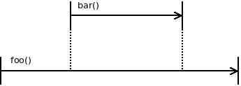

# Structured Concurrency

* Title: Exploring Structured Concurrency
* Editor: Chris Foster <chris42f@gmail.com>
* Created: 2019-09-12
* Status: Work in progress
* Discussion: [JuliaLange/julia#33248](https://github.com/JuliaLang/julia/issues/33248)

Here are some notes surveying structured concurrency as it can be applied to
Julia.

Julia has supported non-parallel concurrency since very early on and a
restricted form of parallel programming with the `@threads` macro since version
0.5.

In julia 1.3 a threadsafe runtime for truly parallel tasks [has
arrived](https://julialang.org/blog/2019/07/multithreading) which will greatly
increase their appeal in Julia's numerical and technical computing community.
It's time to think about APIs where users can express concurrent computation in
a safe and composable way.

### Background terminology

For clarity, here's a few items of terminology:

* A Julia [**task**](https://docs.julialang.org/en/v1/manual/control-flow/index.html#man-tasks-1)
  stores the computational state needed to continue execution of a nested set
  of function calls. In the standard runtime this includes any native stack
  frames, CPU registers and julia runtime state needed to suspend and resume
  execution.
* A program is **concurrent** when there are multiple tasks which have started
  but not yet completed at a given time.
* A program is **parallel** when two or more tasks are executing at a given
  time.

With these definitions, parallelism implies concurrency but a concurrent
program can be non-parallel if the runtime serially interleaves task execution.
See, for example,
[section 2.1.2](https://books.google.com.au/books?redir_esc=y&id=J5-ckoCgc3IC&q=paralleism+versus+concurrency#v=snippet&q=paralleism%20versus%20concurrency&f=false)
of "Introduction to Concurrency in Programming Languages".

### What is structured concurrency?

To quote the [`libdill` documentation](http://libdill.org/structured-concurrency.html),

> Structured concurrency means that lifetimes of concurrent functions are
> cleanly nested. If coroutine `foo` launches coroutine `bar`, then `bar` must
> finish before `foo` finishes.
>
> This is not structured concurrency:
>
> 
>
> This is structured concurrency:
>
> 

It's all about composability. Structured concurrency is good because it
reasserts the function call as the natural unit of program composition, where
the lifetime of a computation is delimited in the *structure of the source
code*. Without this,

* Task failures can go unhandled because there's nowhere to propagate the error.
* Task lifetime is not defined by the source code. When a task starts and
  whether it runs to completion is an implementation detail of the runtime.
* Computation cannot be cancelled systematically because there's no natural
  tree of child tasks.
* Scope-based resource cleanup (eg, with `open(...) do io`) is broken because
  task local context can leak from parents into long running children.

For a colourful view on the downsides of unstructured concurrency, `@njsmith`
has expressed it this way in his blog post [Notes on structured concurrency or,
"go statement considered harmful"](https://vorpus.org/blog/notes-on-structured-concurrency-or-go-statement-considered-harmful/#conclusion):

> The popular concurrency primitives — go statements, thread spawning
> functions, callbacks, futures, promises, ... they're all variants on `goto`,
> in theory and in practice. And not even the modern domesticated `goto`, but the
> old-testament fire-and-brimstone `goto`, that could leap across function
> boundaries. These primitives are dangerous even if we don't use them
> directly, because they undermine our ability to reason about control flow and
> compose complex systems out of abstract modular parts, and they interfere
> with useful language features like automatic resource cleanup and error
> propagation. Therefore, like goto, they have no place in a modern high-level
> language.


### Structured concurrency in Julia 1.0?

Julia 1.0 supports a limited kind of structured concurrency via the `@sync`
block which waits for lexically contained child tasks (scheduled using
`@async`) to complete. However, like Go, there's no requirement that concurrent
work is actually scoped this way; that's completely up to the user and they may
use `@async` anywhere. At first sight, it may seem just as natural to choose an
unstructured
[communicating seqential processes](https://en.wikipedia.org/wiki/Communicating_sequential_processes)
(CSP) style in current Julia.

Even if the user chooses structured concurrency with `@sync`, they are still
faced with implementing robust cancellation machinery by hand using `Channel`s.
This is the big missing piece required for the natural use of structured
concurrency in Julia.


## Cancellation and preemption

A robust task cancellation system is required to express structured
concurrency. Without it, child tasks cannot be systematically managed in
response to events such as a timeout from the parent or the failure of a
sibling. For a great discussion of cancellation and a survey of cancellation
APIs see the blog post ["Timeouts and cancellation for
humans"](https://vorpus.org/blog/timeouts-and-cancellation-for-humans).

**Big challenge**: how do we handle cancellation safely but in a timely way?
What are the valid cancellation points and can we have cancellation which is
both timely, safe and efficient in a wide variety of situations? Ideally we'd
like tight numerical loops to be cancellable as well as IO. And we want all
this without the performance penalty of inserting extra checks or safe points
into loop code.

### The challenge of preemptive cancellation

At first sight one might hope to treat preemptive cancellation somewhat like
`InterruptException`: wake the task, deliver a signal to its thread to generate
a `CanceledException` which then unwinds the stack, running regular user
cleanup code.

The key difficulty here is that arbitrary preemptive cancellation can occur in
any location with no syntactic hint in the source. Others [have
claimed](https://github.com/golang/go/issues/29011#issuecomment-443441031) that
this makes arbitrary cancellation an impossible problem for user code. The
standard compromise is to make only a core set of operations (including IO)
cancellable. This is the solution offered in
[Python Trio checkpoints](https://trio.readthedocs.io/en/stable/reference-core.html#checkpoints),
libdill's family of IO functions and in pthreads (see [pthread\_cancel](http://man7.org/linux/man-pages/man3/pthread_cancel.3.html)
and [pthreads cancellation points](http://man7.org/linux/man-pages/man7/pthreads.7.html)).
In contrast, consider the failed preemptive cancellation APIs
[Java `Thread.stop`](https://docs.oracle.com/javase/1.5.0/docs/guide/misc/threadPrimitiveDeprecation.html)
Windows API
[`TerminateThread`](https://devblogs.microsoft.com/oldnewthing/?p=91811),
both of which were found to be fundamentally non-robust.

Let's consider the ways in which current julia code can be non-robust in the
face of `InterruptException`. A particular difficulty occurs in resource
acquisition. Consider this snippet from task.jl:

```julia
lock(t.donenotify)
# < What if InterruptException is thrown here?
try
    while !istaskdone(t)
        wait(t.donenotify)
    end
finally
    unlock(t.donenotify)
end
```

In Julia we have the escape hatch `disable_sigint` (`jl_sigatomic_begin` in the
runtime) for deferring `InterruptException`, but most code doesn't consider or
use this which makes user resource handling broken by default.

So it's fairly clear that arbitrary cancellation without cleanup is a
non-starter and that arbitrary cancellation with cleanup is difficult. But that
leaves us in a difficult situation: how do we allow for cancellation of
expensive numerical operations? Are there options for cancellation of numerical
loops with a semantic which can be understood by users? The Go people seem to
consider that arbitrary *preemption* is workable, but can arbitrary
cancellation be made to work with the right language and library features?

#### Runtime technicalities for preemption

On a technical level, our runtime situation in julia-1.3 is very similar to
Go where preemption is cooperative and a rouge goroutine can sometimes wedge
the entire system. There has been a large amount of work in the Go community to
address this, leading to the proposal
["Non-cooperative goroutine preemption"](https://github.com/golang/proposal/blob/master/design/24543-non-cooperative-preemption.md).
In the process, several interesting alternatives
[were assessed](https://github.com/golang/go/issues/24543) including cooperative
preemption of loops (by the insertion of safe points) and more complex
mechanisms such as returning from a signal to out-of-line code which leads
quicly to a safe point.

## Syntax

When comparing to solutions in other languages it's important to mention that
many have introduced special syntax to mark concurrent code.

* C# introduced `async`/`await`; many followed (Python, Rust, ...). This makes
  potential suspension points syntactic.
* `await` in Python marks preemption points. `async` is required to go with it,
  forming a chain of custody around "potentially suspending" functions.
* Kotlin has `suspend` to introduce a special calling convention which passes
  along the coroutine context.
* Go doesn't have `async` or `await` but is deeply concurrent and is the best
  analogy to Julia.

The problem with `async`/`suspend` is that it splits the world of functions in
two, as nicely expressed in Bob Nystrom's blog post
["What color is your function?"](http://journal.stuffwithstuff.com/2015/02/01/what-color-is-your-function/).
This is a barrier to composability because higher order functions have to know
about the color of the function they're being passed. Bob argues that Go
handles this in the nicest way by having first class support for continuations
in the language. The Julia runtime does this in the same way.

On the other hand, a syntax such as `async`/`await` is arguably a useful visual
marker for possible cancellation points (`await`) and for which functions are
cancellable (`async`). Note that this doesn't have to be implemented at the
language level; for example, Go's context and errgroup also allow the reader to
recognize where the cancellation can happen (listening to the Done channel) and
which functions can be cancelled (those that accept Context as an argument).

## Prototypical use cases

* The "happy eyeballs" algorithm is becoming a standard example of structured
  concurrency thanks to `@njsmith`'s tutorial at PyCon 2018.
  - [General discussion](https://trio.discourse.group/t/happy-eyeballs-structured-concurrencys-hello-world/57)
  - [Trio implementation](https://github.com/python-trio/trio/blob/master/trio/_highlevel_open_tcp_stream.py)
  - [Libdill implementation](https://github.com/sustrik/libdill/blob/master/happyeyeballs.c) and [discussion](http://250bpm.com/blog:139)
* The Go concurrency tutorial — in his talk `@elizarov` suggested that
  implementing all the examples there was a great inspiriation.

## Related julia issues and prototypes

* [Tapir parrallel IR](https://github.com/JuliaLang/julia/pull/31086)

* [API Request : Interrupt and terminate a task](https://github.com/JuliaLang/julia/issues/6283)
* [Error handling in tasks](https://github.com/JuliaLang/julia/issues/32677)
* [Uncaught exceptions from tasks](https://github.com/JuliaLang/julia/issues/32034)
* [silent errors in Tasks](https://github.com/JuliaLang/julia/issues/10405)
* [asyncmap: Include original backtrace in rethrown exception](https://github.com/JuliaLang/julia/pull/32749)

TODO: We should organize these, and more, with a tag.

* [Awaits.jl](https://github.com/tkf/Awaits.jl)


## Resources

A lot has been written on structured concurrency quite recently. Relevant
implementations are available in C, Kotlin and Python, with Go also having to
deal with many of the same issues. The Trio forum has a section dedicated to
the [language-independent discussion of structured
concurrency](https://trio.discourse.group/c/structured-concurrency).

#### Links

* [Structured concurrency resources - Structured concurrency - Trio forum](https://trio.discourse.group/t/structured-concurrency-resources/21)
* [Reading list · Python-Trio/Trio Wiki](https://github.com/python-trio/trio/wiki/Reading-list)

#### People in the wider community

* Bob Nystrom ([`@munificent`](http://journal.stuffwithstuff.com)) works on the
  Dart language at google. Regarding async/await, he wrote a very on-topic post
  - [What color is your function?](http://journal.stuffwithstuff.com/2015/02/01/what-color-is-your-function/).
* Martin Sústrik ([`@sustrik`](https://github.com/sustrik)) is the author of
  the C library libdill, and has a interesting [blog](http://250bpm.com/) in
  which the term "structured concurrency" appears to have (perhaps) first
  appeared:
  - [Structured Concurrency](http://250bpm.com/blog:71)
  - [Update on Structured Concurrency](http://250bpm.com/blog:137)
  - [Two approaches to structured concurrency](http://250bpm.com/blog:139)
* Nathanial Smith ([`@njsmith`](https://github.com/njsmith)) is the author of
  the Python Trio library and a key advocate of structured concurrency. His
  [blog](https://vorpus.org/blog/archives.html) has several very interesting
  posts on the topic.
  - [Timeouts and cancellation for humans](https://vorpus.org/blog/timeouts-and-cancellation-for-humans)
  - [Notes on structured concurrency, or: go statement considered harmful](https://vorpus.org/blog/notes-on-structured-concurrency-or-go-statement-considered-harmful/).

  See also his PyCon 2018 talk:
  - [Nathaniel J. Smith - Trio: Async concurrency for mere mortals - PyCon 2018 - YouTube](https://www.youtube.com/watch?v=oLkfnc_UMcE)
* Roman Elizarov ([`@elizarov`](https://github.com/elizarov)) is the team lead
  for Kotlin libraries at JetBrains. Here's his [blog](https://medium.com/@elizarov).
  - [Structured concurrency](https://youtu.be/hW4vjgtPCAY?t=25960) for Kotlin talk at Hydraconf ([talk abstract](https://hydraconf.com/2019/talks/68l5ztovlf0xm9aindouzr))
  - [Kotlin structured concurrency blog post](https://medium.com/@elizarov/structured-concurrency-722d765aa952)

#### Structured concurrency libraries

* [libdill (C)](http://libdill.org/structured-concurrency.html)
* [Trio (Python)](https://trio.readthedocs.io/en/stable)
* [Kotlin coroutines](https://kotlinlang.org/docs/reference/coroutines/basics.html#structured-concurrency)

#### Cancellation

* Python
  - [Timeouts and cancellation for humans](https://vorpus.org/blog/timeouts-and-cancellation-for-humans)
* Go
  - [errgroup](https://godoc.org/golang.org/x/sync/errgroup)
  - [context](https://golang.org/pkg/context)
  - [Discussion of using the Trio approach for Go](https://github.com/golang/go/issues/29011)
